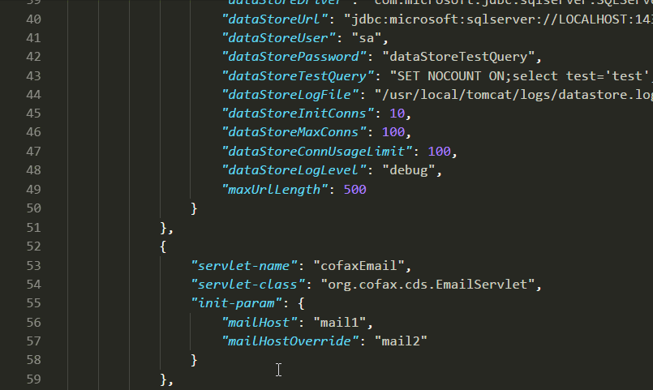
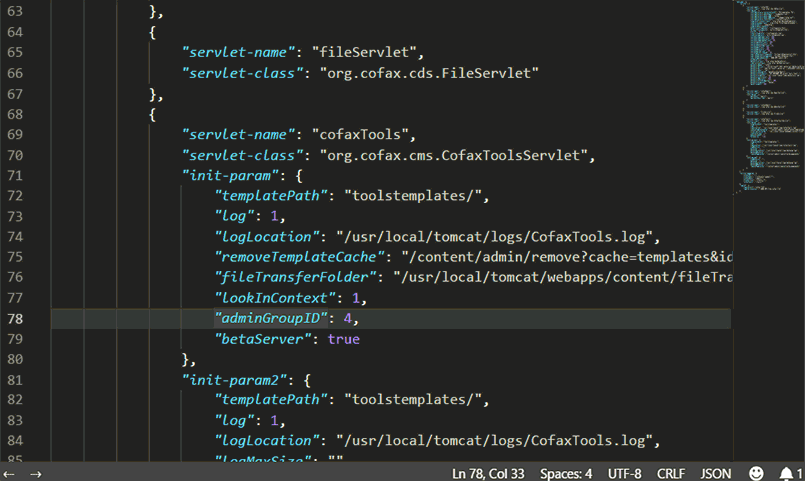
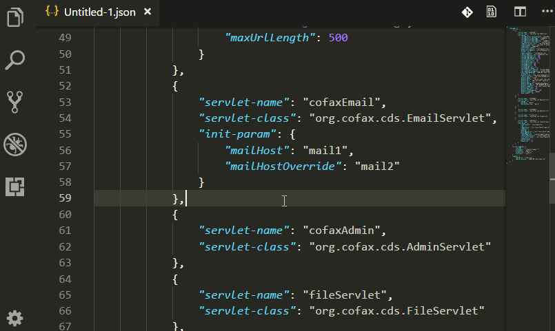

# JSON-Helper

  

## New features in v1.3

|||
|:---:|:---|
|Outline for file|"`jsonHelper: Show JSON outline`" command will show the outline of the whole JSON file|
|Outline for current key|"`▤`" button on hover window will show the outline of the current layer and children of the current key, configure propery "`jsonHelper.quickpick.maxlayer`" to limit the max layer depth for children in outline, default "`99`"|

## Description

Help you navigate your JSON file with hover window, navigator and outline.

- You can customize the JSON object name by changing property "`jsonHelper.object.name`", default value: "`jsonObj`"
- In order to copy path to clipboard, you need to run "`sudo apt install xsel`" to install `xsel` in Linux

> Note: Only works with pure JSON file.

## Preview

### Hover

### Navigator

### Outline

