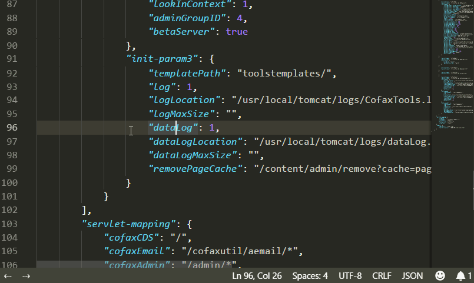

# JSON-Helper

Privide a hover popup window to show the call path for the key it focuses, and a simple navigator to help you navigate to the previou or next key in the same layer.

- You can customize the JSON object name by changing property "`jsonHelper.object.name`", default value: "`jsonObj`"
- In order to copy path to clipboard, you need to run "`sudo apt install xsel`" to install `xsel` in Linux

> Note: Only works for pure ".json" files.

## Preview

### Hover

### Navigator

