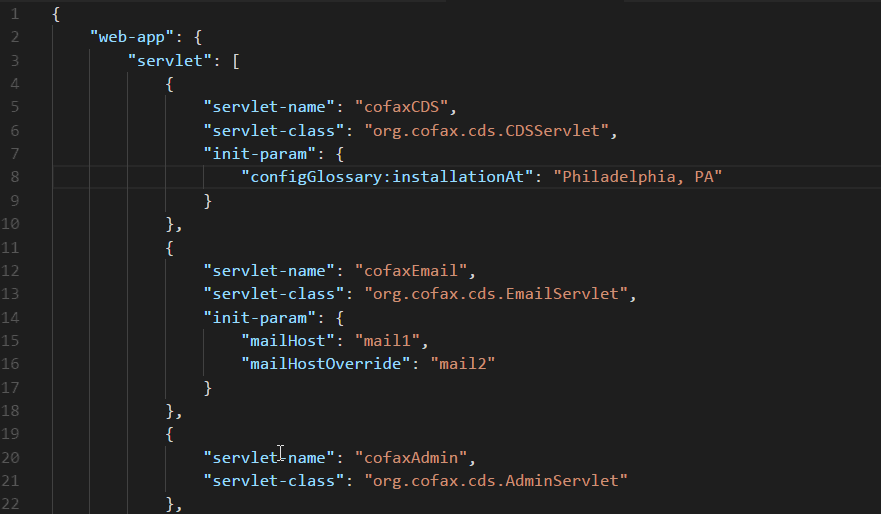

# JSON-Helper

Privide a hover popup window to describe which layer for the key you are in now.
>Notes: Only works with pure ".json" files

[View the code](https://github.com/mine2chow/JSON-Helper)

## Preview

